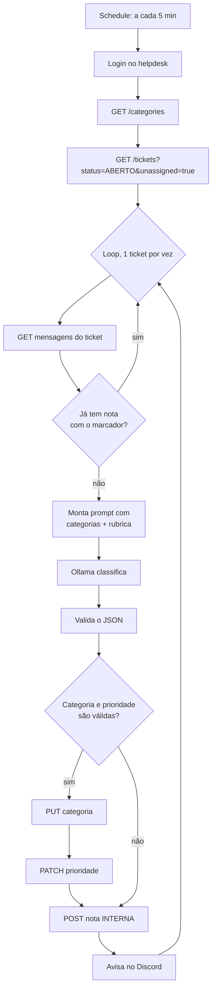

# Triagem de tickets com IA local

Camada de automação **desta API**: um chamado entra na fila, um LLM **rodando na
própria máquina** classifica categoria e prioridade, escreve um resumo como nota
interna e avisa a equipe no Discord.

> Para a API em si — endpoints, regras de negócio, como subir — veja o
> [README principal](../README.md).

**n8n** (self-hosted) · **Ollama** + `qwen2.5:7b` · **MySQL 8** · **Discord webhook**

> **Custo: R$ 0.** Nenhuma chave de API paga, nenhum serviço por assinatura. O
> modelo roda local, o n8n é self-hosted, o webhook do Discord é gratuito.

---

## O problema

Um chamado novo cai na fila e fica lá até alguém abrir, ler e decidir categoria e
prioridade. Enquanto isso, um cliente cobrado em duplicidade espera do lado de
uma dúvida sobre garantia — porque ninguém ainda olhou.

A automação faz essa leitura em segundos e **prepara o terreno sem tomar a
decisão**: ela não assume o ticket, não responde o cliente, não fecha nada.



---

## A armadilha que quase passou despercebida

O helpdesk tem esta regra em `message.service.js`:

```js
if (isStaff(actor) && !isInternal && ticket.status === TICKET_STATUS.ABERTO) {
  await ticketRepository.update(ticket.id, {
    status: TICKET_STATUS.EM_ATENDIMENTO,
    agentId: ticket.agent?.id ?? actor.id,
  });
}
```

Atendente que responde publicamente um ticket `ABERTO` sem dono **assume** o
ticket. O bot é atendente.

Se ele postasse o resumo como mensagem normal, cada triagem tiraria o chamado da
fila e marcaria um robô como responsável. O ticket sumiria da tela dos
atendentes como "em atendimento", ninguém trabalharia nele, e o relatório de SLA
passaria a mentir — **sem um único erro no log**.

A correção é uma flag: `isInternal: true`. A própria regra exclui nota interna de
propósito. E existe um teste que falha se alguém remover essa flag, explicando
exatamente isso.

**A lição:** antes de automatizar um sistema, ler os *efeitos colaterais* das
rotas que a automação vai chamar.

---

## O erro que só apareceu em dados reais

A primeira versão da rubrica de prioridade usava critérios de **suporte interno
de TI** — "quantas pessoas param de trabalhar", "existe contorno" — com exemplos
como *"trocar o mouse"* e *"ninguém da empresa acessa o sistema"*.

Rodou. Passou nos meus quatro casos de teste. E na primeira execução real:

| Chamado | Antes | Depois da IA |
|---|---|---|
| **Cobrança duplicada no cartão** | URGENTE | **BAIXA** |

Justificativa do modelo: *"1 pessoa, existe alternativa"*.

**O modelo aplicou a rubrica corretamente. A rubrica é que estava errada.** As
categorias reais deste helpdesk são Pagamento, Entrega, Produto, Garantia, Conta
— é atendimento ao cliente, não TI interna. Um cliente cobrado duas vezes não
"para de trabalhar", então a régua o jogava em BAIXA.

O erro era invisível nos testes porque **eu inventei os casos de teste com a mesma
régua torta**.

### A rubrica corrigida

| Nível | Critério |
|---|---|
| **URGENTE** | Vários clientes atingidos, dano irreversível, ou prazo legal vencendo |
| **ALTA** | Dinheiro de **um** cliente em risco, pagou e não recebeu, ou prazo contratual próximo |
| **MEDIA** | Problema real com contorno; insatisfação sem perda financeira |
| **BAIXA** | Dúvida, informação, pedido sem prazo |

Validada em chamados reais, todos abertos como "Outros" (que é o que cliente de
verdade escolhe), para a IA ter que corrigir categoria **e** prioridade:

| Chamado | Resultado |
|---|---|
| "Esqueci a senha, sem pressa" | BAIXA ✅ |
| "Produto veio com risco na lateral, mas funciona" | MEDIA ✅ |
| "Fui cobrado duas vezes no mesmo pedido" | ALTA ✅ |
| "Oito moradores do prédio cobrados em duplicidade, R$ 3 mil" | URGENTE ✅ |

---

## Por que o modelo de 7B e não o de 3B

Testados os dois com os mesmos quatro chamados:

| Chamado | Esperado | `qwen2.5:3b` | `qwen2.5:7b` |
|---|---|---|---|
| "Esqueci a senha, sem pressa" | BAIXA | 🔴 URGENTE | ✅ BAIXA |
| Impressora quebrada (têm outra) | MEDIA | 🔴 URGENTE | ✅ MEDIA |
| NF trava, prazo, multa | ALTA | 🔴 URGENTE | ✅ ALTA |
| Operação parada, 40 pessoas | URGENTE | ✅ URGENTE | ✅ URGENTE |

O 3B **acertou todas as categorias e errou todas as prioridades**. Categoria é
reconhecimento de padrão; prioridade exige julgar impacto — e é essa capacidade
que falta num modelo pequeno.

Três tentativas de engenharia de prompt não resolveram, incluindo uma em que o
LLM só extraía fatos e uma tabela determinística decidia. **Essa falhou porque a
extração também errava** — dizia "setor" para um chamado de uma pessoa só.
Regra determinística sobre entrada errada continua errada.

### O que faz o prompt funcionar

1. **Rubrica com critério objetivo** — "existe alternativa?", "quantos clientes?",
   "há prazo?" — em vez de adjetivos como "crítico".
2. **Calibração explícita:** *"URGENTE é raro, menos de 1 em 20."* Sem essa linha,
   o modelo marca tudo como urgente.
3. **Ordem dos campos:** `sinais` e `impacto` vêm **antes** de `priority` no JSON.
   O modelo gera token a token, então a decisão sai do raciocínio já escrito.

Não há campo de confiança: o modelo respondia `0.9` em tudo, inclusive nos erros.
**Auto-avaliação de confiança não serve de portão; validação de schema serve.**

Desempenho: ~55 s no primeiro chamado (carregar na VRAM), depois **~4 s** por
chamado numa GTX 1660 SUPER de 6 GB.

---

## O bug que a bateria de testes encontrou

Com 35 chamados na fila, a automação **parou de processar e não deu nenhum
sinal**. Quinze tickets ficaram 26 minutos parados enquanto todas as execuções
apareciam como `success`.

A causa é a interação entre duas decisões corretas. A busca era `limit=20`
ordenada por `createdAt asc`. E o bot **não assume o ticket** de propósito —
então chamado já triado continua `ABERTO` e sem dono, e continua aparecendo na
busca. Quando chegaram a 20, ocuparam todos os slots:

```
busca retorna    : 20 tickets
já triados       : 20   ← todos
novos a processar: 0
```

Nada quebra. Nenhum node fica vermelho, nenhum retry dispara, o painel mostra
sucesso a cada 5 minutos. **Você só descobriria por reclamação de cliente.**

Corrigido com ordem `desc` e `limit=100`: de travado indefinidamente para **15
chamados num único ciclo**, fila zerada em 5,7 minutos. A auditoria ganhou
verificações para impedir a ordem `asc` de voltar.

> É mitigação, não cura. Com 100 tickets encalhados o problema volta. A cura é a
> **v2 por webhook** (ver Próximos passos).

---

## Testes

Rodam **offline**, sem precisar de nenhum serviço no ar:

```bash
node testes/testa-validador.js   # 15 casos
node testes/audita-workflow.js   # 23 verificações
```

**`testa-validador.js`** executa o `jsCode` **real** extraído do workflow, com
entradas simuladas — teste que reimplementa a lógica testa a cópia, não o que
roda. Barra categoria alucinada, prioridade inventada, texto solto, JSON
truncado, `null`, array, campos faltando, id negativo. E verifica duas
invariantes em todos os casos: a nota sempre existe com o marcador, e quando a
validação falha a categoria e a prioridade saem nulas, para nada chegar na API.

**`audita-workflow.js`** não testa lógica: testa que as **proteções continuam no
lugar**. Cada verificação explica por que importa — se o `isInternal: true`
sumir, o teste falha dizendo que o robô passaria a sequestrar tickets da fila.

### Resiliência, testada derrubando serviço de propósito

| Cenário | Comportamento verificado |
|---|---|
| Ollama fora do ar | Execução falha limpa; **ticket não é alterado**, nenhuma nota escrita |
| Ollama volta | Recupera sozinho no ciclo seguinte, **sem nota duplicada** |
| API do helpdesk fora | Execução falha limpa no login |
| Descrição de 5.000 caracteres | Sem truncamento — o fato decisivo estava nos últimos 170 e foi capturado |

---

## Decisões de desenho

**O bot é `ATENDENTE`, não `ADMIN`.** Menor privilégio: só precisaria de admin
para atribuir ticket a terceiros, e ele não atribui. Como o `authenticate` do
helpdesk relê o usuário do banco a cada requisição, `is_active = false` no bot
**mata a automação na hora**, sem esperar o JWT expirar.

**O bot não assume nem atribui.** `assign` num ticket `ABERTO` muda o status para
`EM_ATENDIMENTO`. Se o bot atribuísse, o ticket ficaria "em atendimento" antes de
qualquer humano olhar.

**Idempotência pelo marcador `[triagem-ia]`.** Antes de processar, o fluxo lê as
mensagens e pula se já houver nota com o marcador. O estado de "já foi triado"
mora **no sistema de registro**, não na memória do n8n: sobrevive a restart, a
reimportar o workflow e a duas instâncias rodando ao mesmo tempo.

**As categorias vêm da API, nunca fixas no prompt.** Categoria nova entraria em
produção sem a IA saber que existe.

**`URGENTE` só nasce na triagem.** No helpdesk, cliente que pede `URGENTE` recebe
`ALTA` — só a equipe chega a urgente. Isso dá papel real à IA em vez de
decorativo.

---

## Como rodar

**Pré-requisitos:** Node 24+, [Ollama](https://ollama.com), MySQL 8, e o
a API deste repositório rodando na porta 3000 (`npm run dev` na raiz).

```bash
ollama pull qwen2.5:7b
```

```bash
npx n8n
```

1. Criar um usuário `ATENDENTE` no helpdesk para o bot
2. Copiar `n8n/workflow-triagem-helpdesk.example.json`, importar no n8n
   (**Workflows → Import from File**)
3. Abrir o node **Config** — é o único lugar a editar: senha do bot e URL do
   webhook do Discord
4. **Publish**, e **reiniciar o n8n**

> ⚠️ O passo 4 não é opcional. Publicar atualiza o banco, mas o agendador
> continua rodando a definição carregada em memória. Conferir no banco não prova
> nada — a prova é o `meta` da resposta HTTP dentro do registro da execução.

### Duas armadilhas de ambiente

**`ollamaUrl` usa `127.0.0.1`, nunca `localhost`.** O Node resolve `localhost`
para `::1` (IPv6) primeiro, e o Ollama escuta só em IPv4 — dá `ECONNREFUSED` com
o serviço no ar.

**`keep_alive` maior que o intervalo do schedule.** O Ollama descarrega o modelo
após 5 minutos de ociosidade. Com schedule de 5 minutos, ele era descarregado e
recarregado a cada ciclo, e cada recarga de ~5 GB era uma aposta contra a memória
disponível.

---

## Limitações e próximos passos

**É polling.** O n8n pergunta a cada 5 minutos se há ticket novo. A **v2** é o
helpdesk **disparar** o evento quando o ticket nasce, pelo padrão **outbox** —
gravar o evento na mesma transação que cria o ticket e entregar depois. Disparar
HTTP dentro da transação é o erro clássico: se o n8n estiver fora, ou a criação
do ticket falha, ou o evento se perde. Isso também elimina a inanição da fila de
vez.

**Roda em uma máquina só**, com o PC ligado. Um VPS barato resolveria.

**Uma divergência de categoria conhecida:** "como altero o endereço de entrega"
foi classificado como `Entrega` em vez de `Conta`. Discutível — o título tem a
palavra "entrega", e um atendente humano poderia fazer o mesmo.
