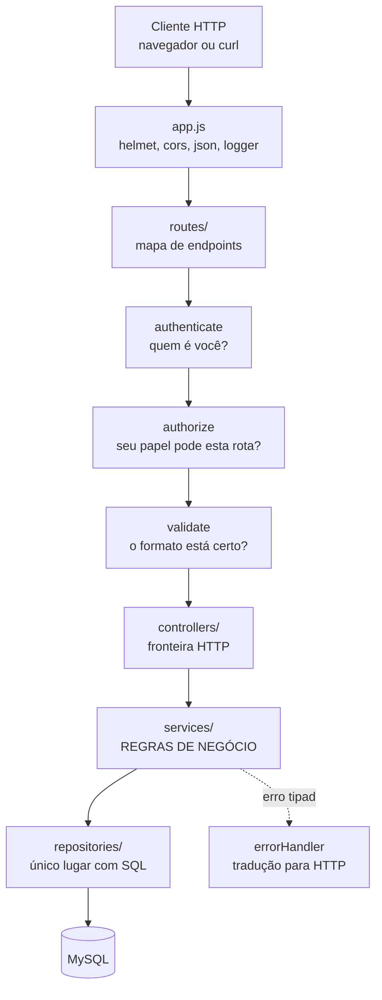
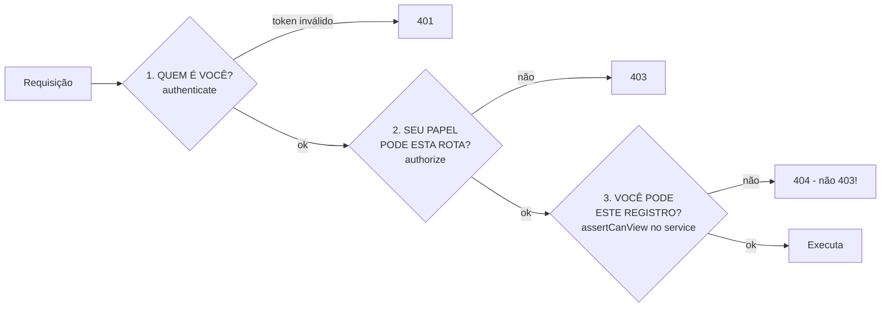
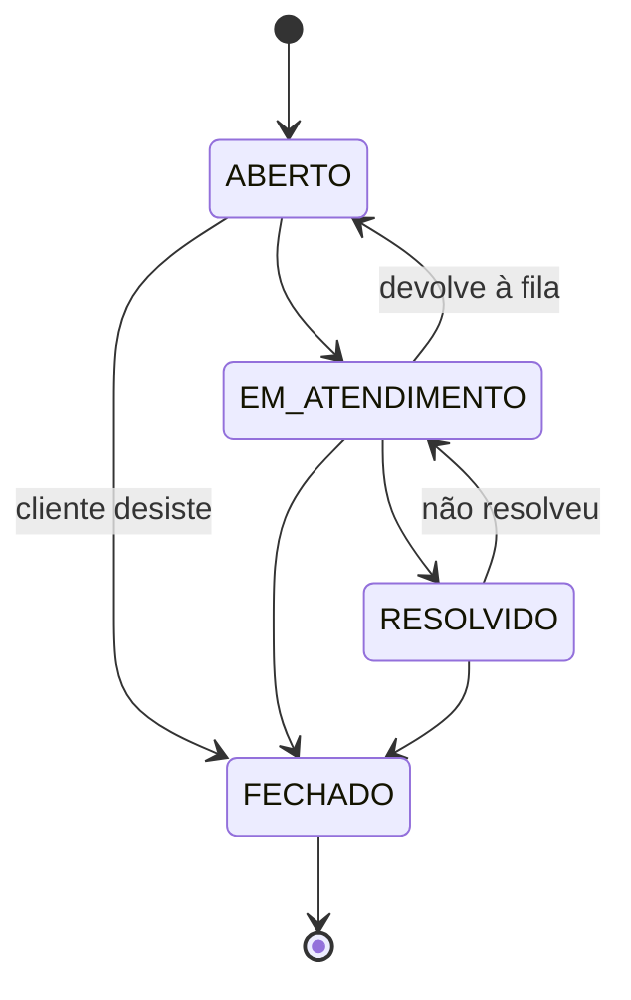
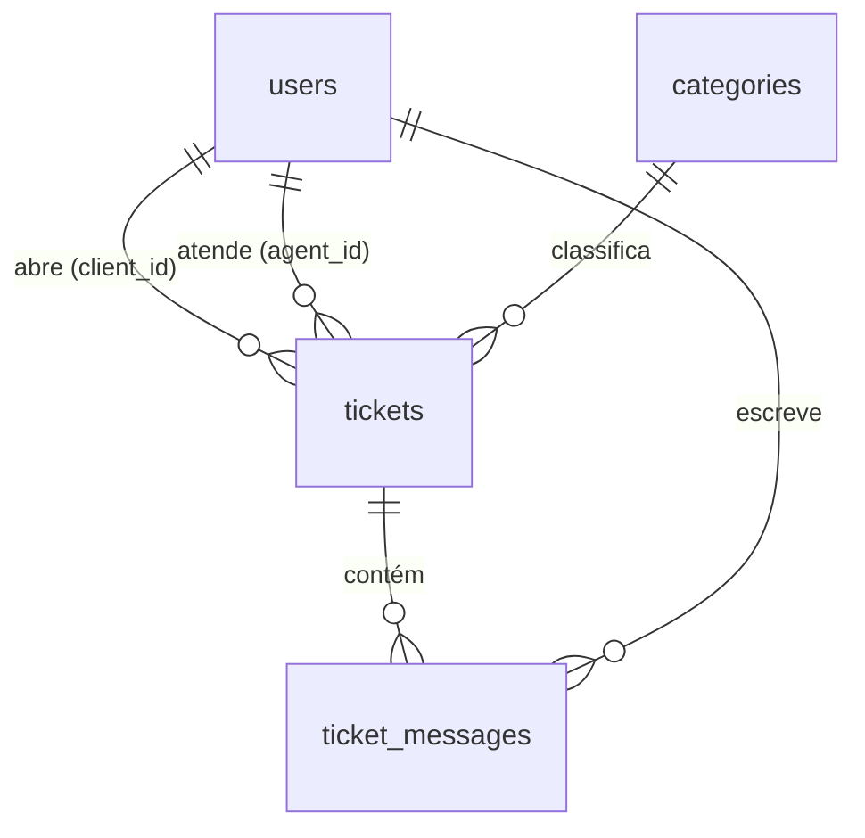

# Help Desk API

> [!abstract] O que é
> API REST de gestão de chamados (tickets) com três papéis — **CLIENTE**, **ATENDENTE** e **ADMIN** —, ciclo de vida controlado por [[Máquina de estados|máquina de estados]], histórico de mensagens preservado e dashboard com métricas.
>
> Projeto de portfólio com **foco em backend**. SQL escrito à mão, sem ORM, para dominar o modelo relacional.

---

## 1. Mapa mental do projeto



**A frase que resume tudo:** cada camada só sabe fazer uma pergunta. Rota pergunta *"esta URL existe?"*, middleware pergunta *"você pode?"*, service pergunta *"faz sentido?"*, repository pergunta *"como busco isso?"*.

---

## 2. As camadas, e por que existem

| Camada | Responde | Nunca faz |
|---|---|---|
| `routes/` | Quais URLs existem e o que cada uma atravessa | Lógica. Um `if` aqui está no lugar errado |
| `middlewares/` | Preocupações transversais (auth, validação, log, erro) | Regra específica de um recurso |
| `validators/` | O dado chegou no **formato** certo? | Decidir **permissão** — não enxerga `req.user` |
| `controllers/` | Extrair de `req`, chamar **um** service, formatar resposta | Regra de negócio |
| `services/` | Pode ou não pode? O que acontece quando? | Conhecer `req`, `res`, status HTTP ou SQL |
| `repositories/` | Como busco/gravo isso no banco? | Qualquer decisão de negócio |

> [!question] Por que assim?
> **"Por que separar Controller e Service? Não é burocracia?"**
>
> Dois argumentos concretos:
>
> 1. **Testabilidade.** A regra *"ticket fechado não recebe mensagem"* não tem nada a ver com HTTP. No service, ela é testada com `node --test` sem subir servidor nem banco. No controller, exigiria simular objetos `req` e `res` falsos.
> 2. **Reuso.** Se amanhã essa regra precisar rodar num job agendado ou num CLI, ela já está isolada. E trocar Express por Fastify não reescreveria nenhuma regra.
>
> O terceiro argumento é mais prático: *"quem pode fechar um ticket?"* tem **exatamente um arquivo** para abrir.

**Regra prática:** controller com mais de ~10 linhas = lógica vazou.

---

## 3. Autenticação, autorização e propriedade

São **duas perguntas** resolvidas em **três camadas** — e a terceira é a que quase todo projeto de portfólio esquece.



### Por que a camada 3 devolve 404 e não 403

Se o cliente A trocar o id na URL e pedir o ticket do cliente B, um **403** confirmaria que aquele ticket existe. O **404** não revela nada. Essa falha tem nome: **IDOR** — *Insecure Direct Object Reference*, do OWASP Top 10.

E ela **não pode viver num middleware**, porque depende de dados que só existem depois de consultar o banco.

> [!warning] Bug real, encontrado pelos testes
> Em `ticket.service.js`, a validação dos **dados** estava rodando antes da checagem de **permissão** — um atendente tentando atribuir ticket a terceiros recebia `400` em vez de `403`.
>
> A ordem correta é **autorização primeiro, dados depois**. Além do status certo, isso evita vazar quais ids de usuário existem e economiza uma query.

### Anatomia do JWT

`header.payload.signature`, separados por ponto, cada parte em Base64**URL**.

> [!danger] O payload NÃO é secreto
> Base64 é **codificação**, não criptografia. Qualquer pessoa cola o token em jwt.io e lê o conteúdo. Por isso nunca vai senha lá dentro — só `id`, `role` e os tempos.
>
> O que a assinatura garante é **integridade**: se alguém trocar `"role": "CLIENTE"` por `"ADMIN"`, o HMAC não bate mais e o token é rejeitado.

**O problema honesto do JWT:** sem estado no servidor, não dá para revogar um token antes de ele expirar. A mitigação aqui é dupla — expiração de **8h** e uma **consulta ao banco a cada requisição** conferindo `role` e `is_active`. Se o admin desativar alguém, o efeito é imediato, mesmo com token válido na mão.

> [!question] Por que assim?
> **"Isso não derruba a vantagem do JWT de não bater no banco?"**
>
> Derruba em parte, e é uma troca consciente. Ganhei revogação imediata; paguei uma query indexada por PK, que é barata. Numa escala maior, a resposta certa seria **refresh token** com rotação — está no roadmap.

### Senhas: por que bcrypt e não SHA-256

| | SHA-256 | bcrypt |
|---|---|---|
| Velocidade | Rápido — **e isso é o problema** | Lento **de propósito** |
| Salt | Manual | Embutido no próprio hash, único por senha |
| Custo ajustável | Não | Sim, o *cost factor* acompanha o hardware |

Hash rápido é ótimo para checar integridade de arquivo e **péssimo** para senha: quem vazar a tabela testa bilhões de tentativas por segundo. O salt por senha é o que impede *rainbow tables* e o que faz duas pessoas com a mesma senha terem hashes diferentes.

---

## 4. A máquina de estados



Ela mora em `constants/index.js` como **dado**, não como cadeia de `if`:

```js
export const STATUS_TRANSITIONS = Object.freeze({
  ABERTO:         ['EM_ATENDIMENTO', 'FECHADO'],
  EM_ATENDIMENTO: ['RESOLVIDO', 'ABERTO', 'FECHADO'],
  RESOLVIDO:      ['FECHADO', 'EM_ATENDIMENTO'],
  FECHADO:        [],   // terminal
});
```

**Por que como dado:** um objeto é testável, imprimível e alterável em um lugar só. Uma cadeia de `if` espalha a mesma decisão por vários arquivos.

**`FECHADO` é terminal.** Um chamado fechado não volta — abre-se outro. Sem isso, qualquer relatório de SLA perde o sentido, porque o histórico vira algo editável.

A mudança de status acontece em **três passos**, nessa ordem:

1. A transição é **legal**? (consulta o mapa)
2. **Quem** está pedindo pode fazê-la? (cliente só fecha ou reabre)
3. **Efeitos colaterais** — carimbar `resolved_at` / `closed_at`.

> [!question] Por que assim?
> **"Por que endpoints de ação (`PATCH /tickets/:id/status`) em vez de um `PUT /tickets/:id` genérico?"**
>
> Porque mudar status **não é editar um campo, é executar uma transição** com regra e efeito colateral. Um `PUT` genérico obrigaria o service a adivinhar a intenção comparando o antes e o depois. A URL explícita torna a operação nomeável, autorizável e documentável separadamente.

---

## 5. Banco de dados



### Decisões de modelagem

**Duas FKs para a mesma tabela `users`.** Um ticket tem um cliente e um atendente, e ambos são usuários. Na consulta isso vira **dois `LEFT JOIN` com alias diferente** (`c` e `a`).

> [!warning] Por que `LEFT JOIN` e não `INNER JOIN`
> `agent_id` é `NULL` enquanto ninguém assumiu. Com `INNER JOIN`, **todo ticket da fila sumiria do resultado** — exatamente os que mais importam.

**Papéis numa coluna `role`, não em três tabelas.** Os três tipos compartilham quase todos os campos; separar exigiria `UNION` em toda consulta de autenticação.

**Categorias como tabela, não `ENUM`.** O admin cria e edita categorias em tempo de execução. `ENUM` exigiria `ALTER TABLE` para isso.

### Políticas de exclusão — cada uma tem um motivo

| FK | Política | Por quê |
|---|---|---|
| `tickets.client_id` | `RESTRICT` | Apagar o cliente deixaria o ticket órfão e destruiria o histórico |
| `tickets.agent_id` | `SET NULL` | Atendente saiu da empresa? O ticket **volta para a fila**, não some |
| `tickets.category_id` | `RESTRICT` | Categoria em uso não pode sumir — por isso ela é **desativada**, não excluída |
| `ticket_messages.ticket_id` | `CASCADE` | Mensagem **não existe sem** o ticket; é parte dele |
| `ticket_messages.user_id` | `RESTRICT` | Preserva a autoria da mensagem |

> [!note] O padrão por trás disso
> `CASCADE` só quando o filho **não faz sentido sozinho**. Em todo o resto, `RESTRICT` ou `SET NULL` — porque em sistema de chamados, **histórico é o produto**.

**`ticket_messages` não tem `updated_at`.** Mensagem é **evento**, não registro editável. Se pudesse ser editada, o histórico deixaria de ser prova de nada.

**Índices:** criados sobre o que realmente aparece no `WHERE` e no `ORDER BY` — `status`, `priority`, `client_id`, `agent_id`, e um composto `(ticket_id, created_at)` para carregar a conversa já ordenada. Índice não é de graça: cada um custa em toda escrita.

---

## 6. SQL injection — a defesa real

A defesa é **prepared statement** (`pool.execute` com `?`), não escapar string. O valor viaja **separado** do comando, então nunca é interpretado como SQL.

Existem exatamente **duas exceções** no projeto:

> [!danger] Onde `?` não funciona
> **1. `LIMIT` / `OFFSET`** — o MySQL não aceita placeholder aí. Solução: passar por `Number.parseInt` antes de interpolar. Se não for número, não chega no SQL.
>
> **2. Nome de coluna no `ORDER BY`** — placeholder vale para **valor**, não para **identificador**. Solução: `z.enum` com uma **whitelist** de colunas permitidas. Qualquer outra coisa é rejeitada com `422` antes de tocar o banco.

Testado: `?sortBy=titulo;DROP TABLE users` → **422**. `?search=' OR 1=1 --` → **0 resultados** (a string vira busca literal, como deveria).

---

## 7. SQL do dashboard

**Agregação condicional** — todos os totais por status em **uma única varredura** da tabela, em vez de quatro `COUNT` separados:

```sql
SELECT
  COUNT(*)                              AS total,
  SUM(status = 'ABERTO')                AS abertos,
  SUM(status = 'EM_ATENDIMENTO')        AS em_atendimento,
  SUM(status = 'RESOLVIDO')             AS resolvidos
FROM tickets;
```

Funciona porque no MySQL a comparação devolve `1` ou `0`, e somar isso conta as linhas que batem.

**`LEFT JOIN` a partir de `categories`** para contar tickets por categoria — assim a categoria com **zero** chamados aparece com `0`. Um `INNER JOIN` a esconderia, e "sumiu do relatório" é diferente de "está zerada".

**`TIMESTAMPDIFF`** para tempo médio de resolução; o `AVG` **ignora `NULL`** sozinho, então tickets não resolvidos não distorcem a média.

**`FIELD(priority, 'BAIXA','MEDIA','ALTA','URGENTE')`** para ordenar por urgência — alfabeticamente, `ALTA` viria antes de `URGENTE`, o que estaria errado.

**`Promise.all`** para disparar as consultas independentes do dashboard em paralelo, já que uma não depende da outra.

---

## 8. Erros

Todo erro sai no **mesmo formato**: `{ success: false, error: { message, details? } }`.

```
service lança                 errorHandler traduz             cliente recebe
──────────────                ───────────────────             ──────────────
NotFoundError('Ticket')   →   404                         →   JSON padrão
ConflictError(...)        →   409                         →   JSON padrão
ForbiddenError(...)       →   403                         →   JSON padrão
ZodError                  →   422 + lista de campos       →   JSON padrão
ER_DUP_ENTRY (MySQL)      →   409 "valor duplicado"       →   sem citar MySQL
TypeError inesperado      →   500 + log com stack         →   sem detalhe interno
```

> [!important] Três garantias
> 1. **Formato único** — o frontend tem um só caminho de tratamento.
> 2. **Infra não vaza** — `"Table 'helpdesk.users' doesn't exist"` vira `"Erro interno do servidor"`. A mensagem original vai só para o log.
> 3. **Zero `try/catch` repetido** — `asyncHandler` encapsula o `.catch(next)` uma vez só.

**Por que o service lança em vez de retornar `{ error }`:** retornar obrigaria **toda** chamada a checar o retorno, e um esquecimento passa silencioso. `throw` sobe sozinho até o handler central.

> [!question] Por que assim?
> **"Por que `asyncHandler` é necessário?"**
>
> O Express 4 não captura rejeição de Promise em handler `async`. Sem o wrapper, um `throw` dentro de função assíncrona **não chega** ao error handler — a requisição fica pendurada até dar timeout.

---

## 9. Regras de negócio que valem citar

Das 24 implementadas, estas mostram que o sistema pensa como help desk de verdade:

- **Cliente não abre ticket `URGENTE`.** Se pedir, é rebaixado para `ALTA`. Senão todo chamado vira urgente e a prioridade perde o significado.
- **Cliente responde ticket `RESOLVIDO` → reabre** automaticamente para `EM_ATENDIMENTO` e limpa `resolved_at`. A solução não funcionou; ele não deveria precisar abrir outro chamado.
- **Atendente responde ticket `ABERTO` sem dono → assume** o ticket e move para `EM_ATENDIMENTO`. Quem respondeu está atendendo.
- **Nota interna não dispara nenhuma das duas.** É conversa entre a equipe, não atendimento — e é filtrada **no SQL**, não no frontend.
- **Ticket `FECHADO` é imutável.** Não recebe mensagem, não muda status, não muda prioridade.
- **O sistema nunca fica sem admin.** Ninguém se autorrebaixa nem se autodesativa, e o último admin é protegido.
- **Criar ticket + primeira mensagem é uma transação.** Ou os dois entram, ou nenhum — nunca um ticket sem histórico.

> [!question] Por que assim?
> **"O frontend já esconde os botões. Por que validar de novo no backend?"**
>
> Porque esconder botão é **conveniência de UI, não segurança**. Qualquer pessoa manda a requisição direto com curl. A regra tem que viver onde não dá para contornar.

---

## 10. O que ficou **de fora**, e por quê

| Decisão | Ganho | Preço |
|---|---|---|
| SQL à mão em vez de ORM | Entender e explicar o modelo relacional | Desenvolvimento mais lento, sem migrações automáticas |
| Sem tabela de auditoria | Modelo simples, viável para uma pessoa | Não reconstrói a linha do tempo completa |
| JWT sem refresh token | Menos complexidade, sem estado | Sem revogação antes de expirar |
| Token no `localStorage` | Simplicidade da demo | Vulnerável a XSS; cookie `httpOnly` seria melhor |
| Logger próprio | Zero dependência, ~40 linhas legíveis | Sem log estruturado, sem rotação |
| Frontend sem framework | Foco no backend, sem build | UI verbosa |

> [!tip] O critério
> Evitar *overengineering* era um requisito declarado do projeto: ele precisa continuar viável para uma pessoa manter. Cada linha da tabela acima é um "não" deliberado, com o custo assumido — não uma lacuna.

---

## 11. Números do projeto

- **63 arquivos**, 4 tabelas, 24 regras de negócio
- **19 testes unitários** (`node --test`, sem servidor nem banco)
- **77 verificações de integração** manuais, todas passando
- Documentação: `README` · `ARCHITECTURE` · `DATABASE` · `API` · `ROADMAP`
- OpenAPI 3.0 em `/api/docs`

```bash
npm install
npm run db:reset
npm run dev
```

Contas de demonstração — senha `Senha@123`:

| E-mail | Papel |
|---|---|
| `admin@helpdesk.com` | ADMIN |
| `bruno@helpdesk.com` | ATENDENTE |
| `diego@cliente.com` | CLIENTE |

---

## Links

- [[Máquina de estados]]
- [[JWT]]
- [[bcrypt e hash de senha]]
- [[SQL injection e prepared statements]]
- [[IDOR e OWASP Top 10]]
- [[Arquitetura em camadas]]
- [[Transações e ACID]]
- [[Índices no MySQL]]
